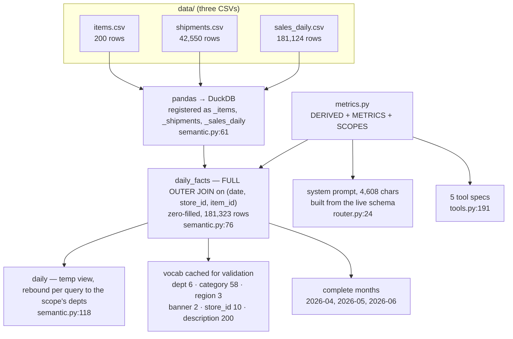
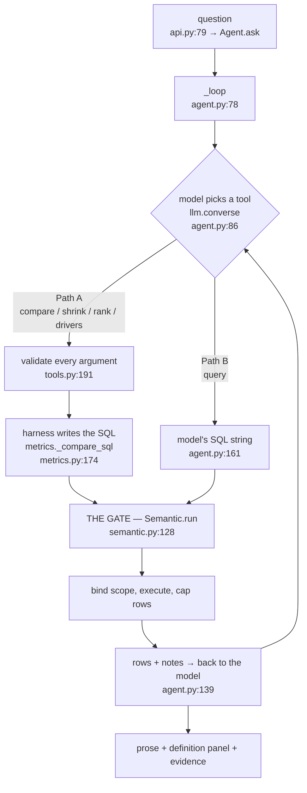
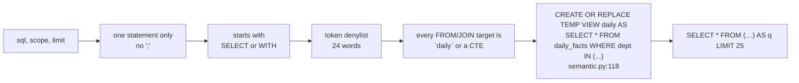

# How a question becomes an answer

Two questions, traced end to end through a running system. Every number, every
SQL string and every error message below was captured from an instrumented run
against Bedrock on 2026-08-12 — nothing here is illustrative.

They were chosen because they take different paths and the difference is the
whole architecture:

| | **Path A** — the shape is known | **Path B** — the shape is not |
|---|---|---|
| Question | *Is shrink up or down versus last month?* | *How did strawberry sales trend over the three months?* |
| Tool chosen | `compare` | `query` |
| Who wrote the SQL | the harness | the model |
| SQL length | 2,186 chars, generated | 175 chars, authored |

The two paths diverge at exactly one point and rejoin at exactly one point.

---

## Layer 0 — before anyone asks anything

This all happens once, at import time, in `Agent.__init__` ([agent.py:53](agent.py#L53)).
The point of this layer is that **the join and the business definitions are
fixed before a user types a character.** Nothing a question says can change them.



Captured at boot:

| | |
|---|---|
| Backend | `bedrock` |
| Date range | 2026-04-01 → 2026-06-30 |
| Rows in `daily_facts` | 181,323 |
| Rows that shipped and never sold | 199 — *these are the highest-shrink rows, and an inner join would drop every one* |
| Tools offered | `shrink`, `compare`, `rank`, `drivers`, `query` |
| Queries run before the first question | 1 (the month list) |

**Why `daily_facts` has more rows than `sales_daily`.** Sales omits
store-item-days with no movement rather than zero-filling them. The full outer
join adds them back — 199 of them. Anchoring sales to shipment dates instead
would drop 77% of sales rows and overstate June shrink by ~860%, and the result
looks entirely plausible. This is stated once, in SQL, at
[semantic.py:76](semantic.py#L76), and `verify.py` re-derives it from the raw
CSVs in pandas and asserts they agree.

---

## The pipeline, both paths



Everything funnels through `Semantic.run`. A typed tool and a hand-written query
get the same validation and the same scope binding, which is why they cannot
disagree about which departments count.

---

# Path A — the system already knows this shape

> **Q: Is shrink up or down versus last month?**

### A1 · The model chooses

One decision, and it is the only one the model makes on this path. Sent 1
message, offered 5 tools, got back:

```json
{ "name": "compare", "input": { "period": "2026-06", "prior": "2026-05" } }
```

Two things are absent, and their absence is the point: **`measure` and `scope`
were not set.** Meridian genuinely disagrees internally about both, so the tool
schemas make them nullable and tell the model that null is the expected answer
when the user did not say ([tools.py:32](tools.py#L32)). A model that cannot say
*"they didn't specify"* will always guess.

The model also resolved *"last month"* to `2026-06` without asking, because the
prompt defines it: *"'Last month', 'this month', 'lately' and 'recently' mean
2026-06, the latest complete month."*

### A2 · Every argument is checked before any SQL exists

`Tools.call` ([tools.py:191](tools.py#L191)) validates first, builds second.
`period` must be in the extract, `prior` defaults to the month before, filters
must resolve against the cached vocab, dimensions must be real.

Real rejections, captured from the same run:

| Call | Response |
|---|---|
| `compare(period="2026-01")` | `2026-01 is not a complete month in this extract. Available: 2026-04, 2026-05, 2026-06.` |
| `shrink(filters={"region": ["Southeast"]})` | `No region matching: Southeast. Valid values: Midwest, Northeast, West.` |
| `rank(by="colour")` | `by must be one of dept, category, region, banner, store_id, description; got 'colour'.` |

An unresolvable filter is an **error, not a drop**. A silently dropped filter is
a number computed over the wrong rows that still looks right — the worst
possible failure for this product. Errors go back to the model as results, so it
reads the reason and corrects itself rather than the request failing.

This is also what makes the string interpolation in `metrics.py` safe: nothing
reaches a SQL builder that did not first match a real value in the data.

### A3 · The harness writes the SQL

`metrics.compare` → `_compare_sql` ([metrics.py:174](metrics.py#L174)) produced
2,186 characters. The model never saw it. Abridged:

```sql
WITH m AS (
  SELECT strftime(date, '%Y-%m') AS month,
         SUM(shipped_units)                  AS shipped_units,
         SUM(sold_units)                     AS sold_units,
         SUM(shipped_units - sold_units)     AS shrink_units,
         SUM(shipped_cost  - sold_cost)      AS shrink_cost,
         SUM(shipped_units - sold_units) / NULLIF(SUM(shipped_units), 0) AS shrink_rate,
         SUM(shipped_cost  - sold_cost)  / NULLIF(SUM(shipped_units - sold_units), 0)
                                             AS cost_per_shrunk_unit
  FROM daily
  WHERE strftime(date, '%Y-%m') IN ('2026-05', '2026-06')
  GROUP BY month
),
p AS (
  SELECT COALESCE(MAX(CASE WHEN month = '2026-05' THEN shrink_units END), 0) AS shrink_units_prior,
         COALESCE(MAX(CASE WHEN month = '2026-06' THEN shrink_units END), 0) AS shrink_units,
         ...                                    -- same for the other 4 measures
  FROM m
)
SELECT shrink_units_prior, shrink_units,
       shrink_units - shrink_units_prior AS shrink_units_delta,
       (shrink_units - shrink_units_prior) / NULLIF(ABS(shrink_units_prior), 0) AS shrink_units_pct,
       ...
FROM p
```

Three things worth pointing at:

1. **Every aggregate is `METRICS` verbatim.** `SUM(shipped_units - sold_units)`
   is not typed here; it is interpolated from
   [metrics.py:50](metrics.py#L50) — the same dict that is injected into the
   system prompt, so the model uses identical text when *it* writes SQL.
2. **The pivot is in SQL, not Python.** Deltas and percentages are computed by
   the query whose text is shown to the user, so there is no arithmetic
   happening off-screen between the rows and the prose.
3. **It is reproducible.** Calling `metrics._compare_sql("2026-06", "2026-05")`
   directly returns a byte-identical 2,186-character string. Verified in the
   capture: `identical_to_builder_output: true`.

### A4 · The gate

`Semantic.run` ([semantic.py:128](semantic.py#L128)) — same door for both paths.



What it actually blocked, captured:

| Attempt | Message |
|---|---|
| `DROP TABLE _items` | `Only SELECT (or WITH ... SELECT) is allowed.` |
| `SELECT 1; SELECT 2` | `Send one statement only; remove the ';'.` |
| `SELECT * FROM read_csv('/etc/passwd')` | `Not allowed here: read_csv. This reads; it cannot change anything or touch files.` |
| `SELECT * FROM _shipments` | `Unknown table(s): _shipments. The only table you can read is` `daily`. |
| `SELECT * FROM daily_facts` | `Unknown table(s): daily_facts. The only table you can read is` `daily`. |

That last one matters most: `daily_facts` is the **unscoped** base view. Blocking
it is what forces scope to be resolved by the harness. `bind_scope` rebound
`daily` to `fresh` before this query ran, so the same SQL under `scope="all"`
returns different numbers — and the system always knows which it used.

### A5 · One row comes back

```
shipped_units    813,573  →  807,821     (−0.71%)
sold_units       758,745  →  746,039     (−1.67%)
shrink_units      54,828  →   61,782     (+12.68%)
shrink_cost     $180,221  → $179,196     (−0.57%)
cost/shrunk unit   $3.29  →    $2.90
```

Plus two **notes** the harness attached without being asked:

> `2026-06 versus 2026-05.`
>
> `The two measures disagree this period: units +12.7% against cost -0.6%. The
> gap is mix -- the average cost of a shrunk unit fell from $3.29 to $2.90.
> Report both, and say the choice of measure changes the conclusion.`

That second note is `metrics.mix_effect` reading the row it just computed. It is
the system telling the model something the model did not think to ask — and it
fires on a rule, so it cannot be forgotten on a bad day.

### A6 · The answer

The model composed the prose. The disclosure did not — `router.resolve`
([router.py:147](router.py#L147)) produced it from the two nulls in A1:

| Question | Chosen | | Alternative |
|---|---|---|---|
| Which departments count? | five fresh departments (Grocery excluded) | `default` | all six departments |
| Units or cost? | both, shown side by side | `default` | — |

The model opened with *"The two measures disagree — and the choice of measure
changes the conclusion."*

---

# Path B — the system does not have this shape

> **Q: How did strawberry sales trend over the three months?**

Nothing about this is a shrink question. It is monthly sales for one item, and
none of the four typed tools expresses it. So the model takes the escape hatch.

### B1 · The model chooses — and writes SQL

```json
{
  "name": "query",
  "input": {
    "sql": "SELECT strftime(date, '%Y-%m') AS month, SUM(sold_units) AS units_sold, SUM(net_sales) AS revenue FROM daily WHERE description ILIKE '%strawberry%' GROUP BY 1 ORDER BY 1",
    "purpose": "Monthly trend of strawberry sales (units and revenue) across all three months."
  }
}
```

175 characters, authored by the model. There is no argument validation step on
this path — there are no typed arguments to validate. `purpose` is required
precisely because the SQL needs a human-readable label in the audit trail.

### B2 · Straight to the same gate

`agent._query` ([agent.py:161](agent.py#L161)) hands the string to
`Semantic.run` unchanged. Same `validate`, same `bind_scope`, same row cap —
50 here instead of 25, because a `query` may legitimately return a longer list.

It passed. `scope` was null, so it defaulted to `fresh` and the view was bound
to the five fresh departments before the query ran. **Note what that means:**
this answer silently excludes any strawberry item in Grocery. That is not a
bug — it is the documented default, and it is disclosed in the definition panel
under the answer.

### B3 · Three rows

| month | units_sold | revenue |
|---|---|---|
| 2026-04 | 5,572 | $22,288 |
| 2026-05 | 5,907 | $23,628 |
| 2026-06 | 5,596 | $22,384 |

With one note attached:

> `This ran your SQL directly, so it did not carry the reviewed shrink logic.
> The query text is shown to the user.`

### B4 · The answer

Same rendering as Path A: prose, definition panel, evidence panel. The evidence
panel tags the step `query` in a different colour from the typed four, because a
reader should know which kind of answer they are looking at.

---

## Where the two paths actually differ

| | Path A (typed tool) | Path B (`query`) |
|---|---|---|
| Who chose the arithmetic | `metrics.py`, reviewed and tested | the model, this turn |
| Who wrote the SQL | the harness | the model |
| Arguments validated against data | yes — month, filters, dimensions | n/a, there are none |
| Scope enforced by view binding | yes | yes |
| Measure enforced | `rank` / `drivers` only | no — the query picks its columns |
| Covered by `verify.py` | yes, 21 checks against raw CSVs | no |
| Failure mode | a wrong definition would be wrong *consistently*, and the tests would catch it | a plausible-looking query that quietly answers a slightly different question |

Path B is strictly more capable and strictly less safe. That is why the prompt
tells the model to prefer the typed four, why the note on every `query` result
says the reviewed logic was bypassed, and why the UI marks it differently.

## What this system does **not** have

Worth saying plainly, because an earlier iteration of this project had all three
and the names still turn up in conversation:

- **No router.** There is no intent classifier. `router.py` builds the prompt and
  owns the disclosure; the routing is the model choosing a tool, and nothing else.
- **No answer templates.** The prose is model-written. An earlier version
  assembled it from templates so a fabricated number was structurally impossible;
  that was traded away for phrasing that can respond to the question actually
  asked. The check is now that the rows are shown directly beneath the claim.
- **No numeric provenance check.** An earlier version machine-verified every
  numeral in the prose against the results. It caught no real fabrications in
  live testing while producing six classes of false positive, so it was dropped.

## How to re-run this trace

```bash
python verify.py                                   # 42 checks, no model needed
FRESHFLOW_BACKEND=bedrock python demo.py "Is shrink up or down versus last month?"
FRESHFLOW_BACKEND=bedrock python demo.py "How did strawberry sales trend over the three months?"
```

`demo.py` prints the tool, the SQL, the row count and the notes for every step,
which is the same information this document walks through.
